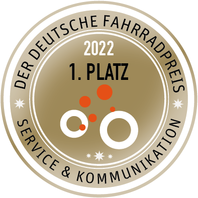

ㅤ

SimRa hat gemeinsam mit dem [OpenBikeSensor](https://www.openbikesensor.org/) den [Deutschen Fahrradpreis 2022](https://www.youtube.com/watch?v=SXpnTjMLdP4) in der Kategorie "Service & Kommunikation" gewonnen!

# Mitmachen
## [=> Jetzt hier mitmachen!](./mitmachen.html)

# Statistiken und Ergebnisse

Die Anzahl der hochgeladenen Fahrten (allgemein und regionspezifisch) kann interaktiv [hier im Dashboard](https://simra-project.github.io/dashboard/) eingesehen werden. Über den Regionsnamen (sofern anklickbar) kann man dort auch auf die jeweils neueste Ergebniskarte zugreifen, über die Incidentzahl kann man die Rohdaten der Incidents runterladen (älterer Snapshot, keine Livedaten).

**Bitte beachten: Aus diversen technischen Gründen arbeitet unser Analysebackend seit April 2025 nicht mehr automatisch (Fahrten können aber weiterhin hochgeladen werden), als Quickfix haben wir einzelne Karten im Herbst 2025 nochmal händisch neu generieren lassen. Aus diversen Gründen haben wir uns entschieden, anstelle weiterer Patches die Analyseplattform komplett neu zu entwickeln und darin dann auch weitere Auswertungen bspw. zu Kreuzungspassierzeiten u.ä. bereitzustellen. Aktuell (Mai 2026) rechnen wir damit, etwa Juni 2026 damit live zu gehen.

[=> Dashboard](https://simra-project.github.io/dashboard/) **

Im August 2020 hatten wir erste vorliegende Ergebnisse für Berlin gemeinsam mit einer Gruppe interessierter Berliner:innen ausgewertet. Dabei haben wir bis dahin auffällige Orte bewertet und als Bericht aufbereitet:
- [Gefahrenstellenreport (komplett)](./2020-08_complete.pdf)
- [Gefahrenstellenreport (besonders gefährliche Abschnitte)](./2020-08_most_dangerous.pdf)

# Projektwebsite

Detaillierte Informationen zum SimRa-Projekt können auf der Projektseite des [ECDF](https://www.digital-future.berlin/forschung/projekte/simra/) abgerufen werden.

# SimRa in Social Media
derzeit beides nur mäßig aktiv betreut
- [Twitter](https://twitter.com/SimRa_App)
- [Instagram](https://www.instagram.com/sicherheitimradverkehr/)
